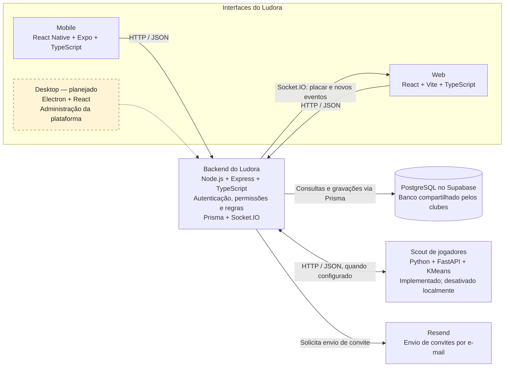
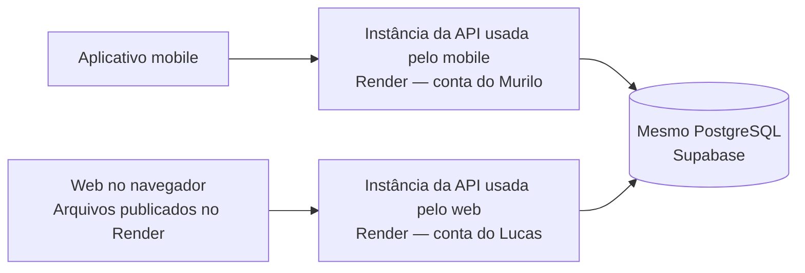

# Arquitetura do Ludora

Referência para a apresentação de andamento. A estrutura foi conferida no
código local em 22/09/2026, na branch `develop`. Os diagramas distinguem o
que existe no repositório do que está planejado e das publicações relatadas
pelo grupo. Não representam uma auditoria dos ambientes do Render.

## 1. Estrutura do sistema

Este é o diagrama principal sugerido para o slide de arquitetura.

**Legenda:** a ligação tracejada do desktop representa trabalho planejado.
As demais ligações representam integrações presentes no código; sua presença
não significa que todos os fluxos tenham sido validados em produção.
HTTP é usado localmente; as publicações devem disponibilizar acesso por HTTPS.

### Como explicar cada parte

| Parte | Responsabilidade | Onde está |
|---|---|---|
| Mobile | Interface para acompanhamento esportivo e operações do clube | `apps/mobile` |
| Web | Interface de consulta e gestão do clube, conforme as permissões | `apps/web` |
| Desktop | Futura interface interna da Ludora para administrar clubes-clientes | `apps/desktop`, ainda apenas reservado |
| API | Receber pedidos, autenticar, autorizar, executar regras e acessar dados | `services/api` |
| Prisma | Biblioteca usada dentro da API para consultar e gravar no PostgreSQL | `services/api/src/lib/prisma.ts` e `services/api/prisma/schema.prisma` |
| Supabase | Hospedagem do banco PostgreSQL utilizado pela API | Configurado no ambiente da API |
| Scout | Receber estatísticas e devolver perfis de jogadores; a API salva os resultados | `services/ml` e `services/api/src/services/scout-ia.service.ts` |
| Resend | Serviço externo que entrega os e-mails de convite solicitados pela API | `services/api/src/services/email.ts` |

O Prisma não é um servidor separado. Node.js e Express também não são duas
APIs: Node.js executa o backend, e Express organiza o recebimento dos pedidos.
React e TypeScript não são alternativas entre si: React organiza a interface,
e TypeScript é a linguagem usada para escrever seu código com tipos.

O frontend conversa com a API; não recebe as credenciais do PostgreSQL.
A autenticação atual usa JWT e senhas verificadas com bcrypt na API, não
Supabase Auth. Não incluir Supabase Auth ou Storage no desenho como integrações
ativas apenas porque o banco está hospedado no Supabase.

### Exemplo de comunicação

1. A pessoa faz login no web ou mobile.
2. A API verifica as credenciais e devolve um token JWT.
3. A pessoa escolhe um clube.
4. Uma consulta envia o token e, nas rotas que exigem contexto de clube, o
   identificador no header `x-clube-id`.
5. A API verifica vínculo, papel e escopo aplicável à operação.
6. A API consulta os dados usando Prisma e responde em JSON.
7. A interface apresenta o resultado.

No web, a conexão Socket.IO também envia token e clube. O servidor verifica
o vínculo e coloca a conexão em uma sala do clube para receber os avisos.
Não afirmar que toda operação já possui sincronização ao vivo: a correção
atual cobre os avisos de placar e criação de eventos recebidos pelo web.
A integração Socket.IO no cliente mobile não foi identificada nesta inspeção;
sua atualização em tempo real deve ser validada separadamente.

## 2. Publicações relatadas pelo grupo

Este segundo desenho trata de hospedagem, não da divisão do código.
O grupo informou duas instâncias da API em contas distintas do Render e um
mesmo banco Supabase. URLs, versões publicadas e configurações ainda precisam
ser confirmadas com Lucas e Murilo.

As duas instâncias podem executar versões diferentes do mesmo backend.
Compartilhar um banco permite consultar os mesmos registros, mas não faz
uma instância enviar automaticamente aos clientes da outra seus avisos
Socket.IO. No código atual, esses avisos são emitidos pelo próprio processo
da API; não foi identificado um mecanismo de distribuição entre instâncias.

Para uma demonstração de atualização ao vivo entre plataformas, o caminho
mais simples é apontar os clientes participantes para a mesma instância da
API, depois de confirmar a compatibilidade e a configuração do ambiente.
Ter múltiplas instâncias com distribuição de eventos é uma evolução posterior.

## 3. Segurança e limites para explicar na apresentação

- A identidade é autenticada com JWT; permissões são verificadas na API.
- O papel pertence ao vínculo `UsuarioClube`, e pode variar entre clubes.
- O banco é compartilhado: relações e filtros por clube sustentam o isolamento.
  Não desenhar um banco independente para cada clube.
- Ocultar um botão não substitui autorização no backend.
- CORS controla quais origens de navegador são aceitas; não substitui login
  nem verificação de vínculo.
- O administrador de um clube não equivale ao administrador da plataforma.
  As permissões e operações exclusivas do futuro desktop ainda precisam
  ser implementadas na API.
- A existência dessas verificações não comprova uma auditoria completa de
  isolamento ou a validação de todas as regras esportivas.

## 4. Sugestão de fala

“O Ludora separa as interfaces das regras e dos dados. Mobile e web enviam
pedidos a uma API em Node.js e Express. Essa API verifica a identidade e as
permissões, aplica as regras e acessa o PostgreSQL hospedado no Supabase por
meio do Prisma. A comunicação de placar e novos eventos no web utiliza
Socket.IO. O projeto também possui um serviço Python de análise de jogadores
e integração de convites por e-mail. O desktop está planejado para a
administração interna da plataforma e usará a API com permissões próprias.”

## 5. O que este diagrama não representa

Ele não é o diagrama de tabelas do banco (DER) nem uma lista de telas.
O DER deve mostrar entidades como `Usuario`, `Clube`, `UsuarioClube`,
`Categoria`, `Jogador`, `Partida` e `Evento`, com suas relações e cardinalidades.
Esses são desenhos complementares à arquitetura apresentada aqui.
